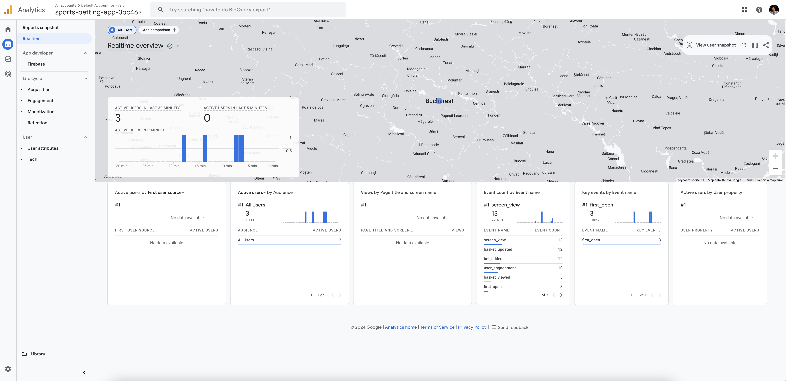
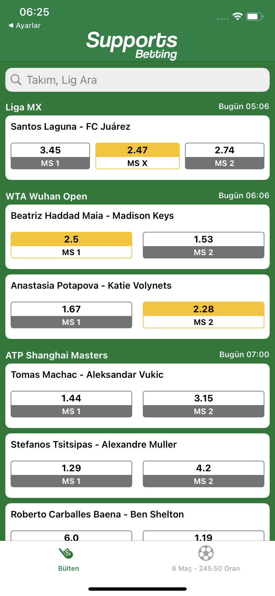
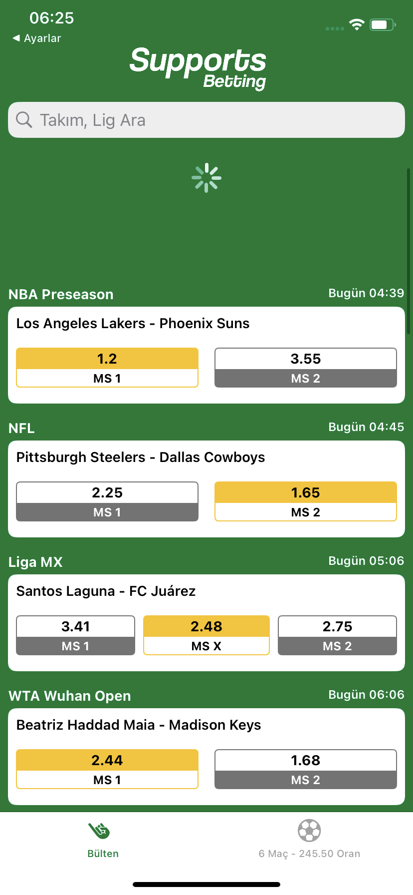
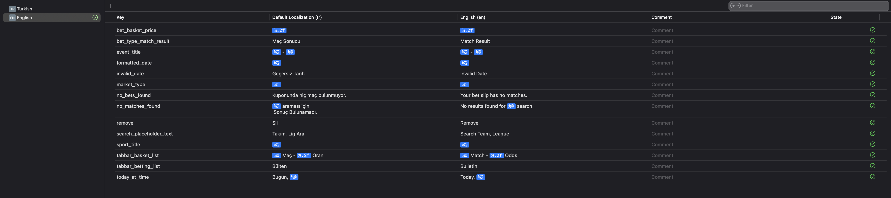

# Sports Betting App

Bu proje, spor bahis uygulaması için geliştirilen bir seviye testi çalışmasıdır. Kullanıcıların spor etkinliklerine bahis oynamalarına olanak tanır ve bahislerini organize ederek bir sepet oluşturma imkanı sağlar.

## 📚 İçindekiler

- [Özellikler](#-özellikler)
- [Teknolojiler](#-teknolojiler)
- [Proje Yapısı](#-proje-yapısı)
- [Modüller](#-modüller)
- [Kurulum](#-kurulum)
- [Kullanım](#-kullanım)

## 🌟 Özellikler 

- Çoklu dil desteği
- Reaktif programlama ile güçlendirilmiş kullanıcı arayüzü
- Gerçek zamanlı bahis oranları ve etkinlik güncellemeleri
- Kişiselleştirilmiş bahis sepeti yönetimi
- Google Analytics ile kullanıcı davranışı takibi

## 🛠 Teknolojiler

- Swift 5
- UIKit
- Combine (Reaktif programlama için)
- Firebase Analytics
- URLSession for Networking
- MVVM Architecture

## 📂 Proje Yapısı

Proje, aşağıdaki ana bileşenleri içerir:

- `Core`: Temel işlevsellik ve altyapı
- `Features`: Ana uygulama özellikleri
- `Extensions`: Swift sınıfları için ek işlevsellik
- `Resources`: Varlıklar ve yapılandırma dosyaları

## 📚 Modüller

Proje, aşağıdaki ana modüllere ayrılmıştır:

- [Core](./Sports%20Betting%20App/Core/README+Core.md)
- [Features](./Sports%20Betting%20App/Features/README+Features.md)
- [Extensions](./Sports%20Betting%20App/Extensions/README+Extensions.md)

Her modülün kendi README dosyası, ilgili bileşenlerin ayrıntılı açıklamalarını içerir.

## 💻 Kurulum 

1. Repoyu klonlayın:
   ```
   git clone https://github.com/ahmetekti/sports-betting-app.git
   ```
2. Xcode ile `Sports Betting App.xcodeproj` dosyasını açın.
3. Projeyi derleyin ve çalıştırın.

## 🎮 Kullanım

Uygulama, ana ekranda mevcut bahis etkinliklerini listeler. Kullanıcılar:

- Etkinlikleri görüntüleyebilir ve arayabilir
- Bahis oranlarını seçebilir
- Seçilen bahisleri sepete ekleyebilir
- Sepeti görüntüleyebilir ve yönetebilir

## 🚀 Özel Özellikler

### Reaktif Programlama

Uygulama, Combine kütüphanesi kullanılarak reaktif programlama prensiplerine göre tasarlanmıştır. Bu sayede:

- Bahis listesi yukarıdan aşağı çekildiğinde sayfa otomatik olarak yenilenir.
- Bahisler sepete eklendiğinde, sepet ve tab bar otomatik olarak güncellenir.

### API Entegrasyonu

Bahis oranları ve etkinlik bilgileri [The Odds API](https://the-odds-api.com/) üzerinden gerçek zamanlı olarak alınmaktır.

### Google Analytics

Kullanıcı davranışları ve uygulama içi etkileşimler, Google Analytics kullanılarak takip edilmektedir. Önemli olaylar ve kullanıcı aksiyonları özel olarak izlenmektedir.
Aşağıdaki ekran görüntüsünde uygulamaya ait verilerin nasıl göründüğünü görebilirsiniz:



Bu dashboard üzerinden şunları izleyebiliyoruz:

- Aktif kullanıcı sayısı
- Oturum süreleri
- En çok ziyaret edilen sayfalar
- Kullanıcı etkileşim oranları


### Dinamik UI

- Beraberlik bahsi (MS X) mevcut olmadığında, UI otomatik olarak kendini ayarlar ve bu seçeneği göstermez.
- Aynı lig ve tarihteki maçlar otomatik olarak gruplandırılır.






### Sepet Yönetimi

Sepetteki bahisler, swipe action kullanılarak kolayca silinebilir.


### Çoklu Dil Desteği
Bu proje şu anda Türkçe ve İngilizce dillerini desteklemektedir. Bu özellik, kullanıcılarımızın uygulamayı kendi tercih ettikleri dilde kullanmalarına olanak sağlar.

Desteklenen Diller

Türkçe (TR)
İngilizce (EN)

Dil Desteğinin Genişletilmesi

Projemiz, soldan sağa yazılan diğer dillerin de kolayca eklenmesine olanak tanıyacak şekilde tasarlanmıştır.



Yukarıdaki görsel, uygulamanın dil seçeneklerini göstermektedir.
